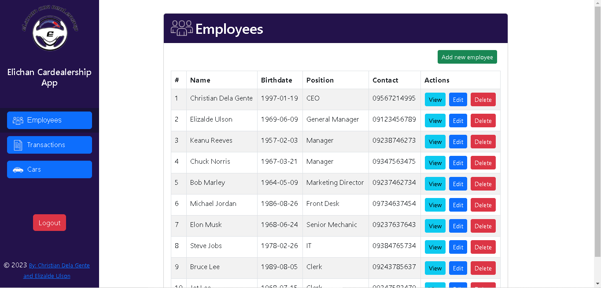
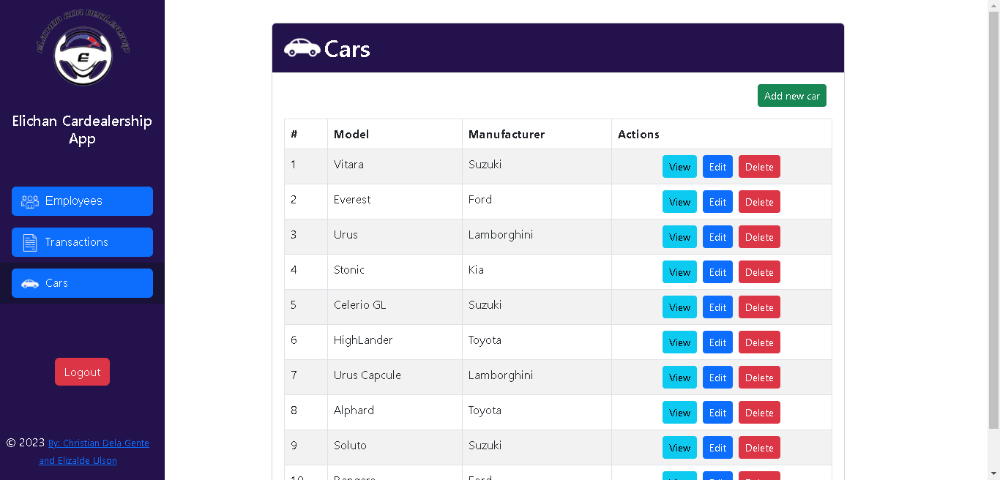

<p align="center"><a href="https://github.com/xchan344" target="_blank"></a></p>

<p align="center">
</a>
</a>
</a>
</a>

<h2> System Features </h2>

- **Sign in & Sign out** - The user can Sign in and Sign out using Registered accounts into the system. this is a security feature to prevent unregistered users from accessing the system.

- **CRUD** - The system has CRUD features:
    1. Create - The user can Add Employee Data, Transaction Data, and Car Data into the system.
    2. Read - The user can view the data from the system's database in the System's webpage.
    3. Update - The user can make changes on the existing data in the databese using this system.
    4. Delete - The user can remove existing data that is irrelevant in the current database.

<br> </br>
- **Sales Calculation** - The user can view the Total Earnings, Total Sales Earnings, Total repair earnings, and Total consult earnings on the top side of the system.

- **Bar Graph Visualization** - The user can view Transaction data in the form of graphs to help better visualize the information.

- **Filter** - The user can filter results so that they can better search for specific Data results.

<br></br>

## Visuals


*The image above shows the Sign In Page*

<br> </br>


*The image above shows the Home Page*

<br> </br>



*The image above shows the Employee Page*

<br> </br>


*The image above shows the Transaction Page*

<br> </br>



*The image above shows the Car Model Page*

<br> </br>


*The gif above shows the working project*

<br> </br>

# Installation

1. Fork the Repository From [xchan344](https://github.com/xchan344/Laravel-Elichan-Cardealership-App) github repositories
2. Install Laravel:
   - Open a terminal or command prompt.
   - Run the following command to create a new Laravel project:

        ```
     composer create-project --prefer-dist laravel/laravel your-project-name
     
        ```
    Replace `your-project-name` with the desired name for your project. This command will download the Laravel framework and set up a new project.

3. Configure Database:
   - Laravel uses a database to store and retrieve data. Open the `.env` file in your project root directory.
   - Update the database connection details according to your database setup. Set the values for `DB_HOST`, `DB_PORT`, `DB_DATABASE`, `DB_USERNAME`, and `DB_PASSWORD` to match your database configuration.

4. Generate Application Key:
   - In the terminal, navigate to your project directory.
   - Run the following command to generate an application key for your Laravel project:
     ```
     php artisan key:generate
     ```
     This key is used to encrypt session data, cookies, and other sensitive information.

5. Serve the Application:
   - While still in the project directory, run the following command to start a development server:
     ```
     php artisan serve
     ```
     This will start the Laravel development server, and you can access your application at `http://localhost:8000` in your web browser.

That's it! You have successfully installed Laravel and set up a new project. You can now start building your application using Laravel's powerful features and tools.


### Requirement:

- [Wampserver](https://www.wampserver.com/en/download-wampserver-64bits/) or [xamppserver](https://www.apachefriends.org) - for running PHP and MySQL

1. Download Wampserver or xamppserver from the provided link
2. Run the installer
3. Follow the installation guide from the installer
4. Finish the installation

<br></br>

- [PHP](https://www.php.net/downloads) - for using the PHP Programming Language

1. Download PHP from the provided Link
2. Extract the downloaded file
3. Copy the Extracted File's Path from the File Explorer's Address Bar
4. Open the System Environment Variables in the Control Panel and Edit it
5. Click Path and Edit
6. Click New then add the Extracted File's Path then press Ok
7. Open Command Prompt and type php --version to confirm the installation

<br></br>

- [Composer](https://getcomposer.org/download/) - Laravel uses Composer to manage its dependencies.
To install Composer, you can follow these steps:

1. Verify System Requirements:
   - Make sure your system meets the following requirements:
     - PHP version 5.3.2 or higher (PHP 7.0 or higher is recommended)
     - The PHP CLI (Command Line Interface) must be installed

2. Download Composer:
   - Go to the official Composer website: [https://getcomposer.org/download/](https://getcomposer.org/download/)
   - Follow the instructions provided on the page to download the Composer installer.

3. Run the Installer:
   - Open your terminal or command prompt.
   - Navigate to the directory where you downloaded the Composer installer.
   - Run the following command to execute the installer:
     ```
     php installer
     ```
     If you're using Windows, the command may be slightly different:
     ```
     php.exe installer
     ```
   - The installer will check your system to ensure all dependencies are met and then guide you through the installation process.

4. Verify the Installation:
   - After the installation is complete, you can verify that Composer is correctly installed by running the following command in your terminal or command prompt:
     ```
     composer --version
     ```
   - If Composer is installed properly, it will display the version number and other details.

<br> </br>

- [MySQL](https://www.mysql.com/downloads/) - For Creating and Editing Database

1. Download MySQL Installer from the provided link
2. Run the installer and Accept License Agreement
3. Select Developer's Default or Full on Setup Type then click Next
4. Select all the Products and Features then click Next
5. click Execute to Download and Install Selected Products and Features then Click Next
6. Select Standalone MySQL Server then click Next
7. Select Development Computer in Config Type then click Next
8. Select "Use Strong Password Encryption for Authentication" in Authentication Method then click Next
9. Type a Password for the root user then click Next
10. Leave the Window Service into default then click Next
11. Execute the Apply Configuration then Click Next
12. Finish the Installation

<br> </br>

- [VSCode](https://code.visualstudio.com) - for Coding

1. Download the VSCode Installer from the provided Link
2. Run the Installer 
3. Accept the License Agreement then click Next
4. Select a File Destination Locartion then click Next
5. Select a Start Menu Folder then Click Next
6. Select Additional Tasks then Click Next
7. Click Install and Wait for it to finish
8. Finish the Installation

<br> </br>

- Running the server

1. On the project's root directory, run the terminal and paste the code below.
     ```
     php artisan serve
     ```
2. Open another terminal on the project's root directoty and paste the code below.
     ```
     npm run dev
     ```
3. Open the link given after you enter the command "php artisan serve" in your browser. or paste the link below in your browser.
     ```
     http://127.0.0.1:8000
     ```

<br> </br>

# Usage

The EliChan Car Dealership app can be used in a number of ways: 

- **Sales Tracking** - with the App, the user can accurately see how much they've sold and gained visually by seeing the Graphs and Sales Calculation
- **Employee Handling** - with the App, the user can easily manage the employees by making adding, deleting, and editing Employees Simple using CRUD
- **Transaction Tracking** - with the App, the user can easily Track the number of Transactions they have done, they can also filter them so that they can easily look for a specific transaction easily.

<br> </br>

# Support

For Questions and Further Assistance, you can Contact us using

- Christian Dela Gente - 201440553@psu.palawan.edu.ph / [xchan344](https://github.com/xchan344) 
- Elizalde Ulson II - 201980044@psu.palawan.edu.ph / [NgtzBogz](https://github.com/NgtzBogz)

<br> </br>

# Authors and Acknowledgements


## [Christian Dela Gente](https://github.com/xchan344)

<br> </br>


## [Elizalde Ulson II](https://github.com/NgtzBogz)

<br> </br>

# License 

**MIT License**

Copyright (c) [2023] [Christian Dela Gente & Elizalde Ulson II]

Permission is hereby granted, free of charge, to any person obtaining a copy
of this software and associated documentation files (the "Software"), to deal
in the Software without restriction, including without limitation the rights
to use, copy, modify, merge, publish, distribute, sublicense, and/or sell
copies of the Software, and to permit persons to whom the Software is
furnished to do so, subject to the following conditions:

The above copyright notice and this permission notice shall be included in all
copies or substantial portions of the Software.

THE SOFTWARE IS PROVIDED "AS IS", WITHOUT WARRANTY OF ANY KIND, EXPRESS OR
IMPLIED, INCLUDING BUT NOT LIMITED TO THE WARRANTIES OF MERCHANTABILITY,
FITNESS FOR A PARTICULAR PURPOSE AND NONINFRINGEMENT. IN NO EVENT SHALL THE
AUTHORS OR COPYRIGHT HOLDERS BE LIABLE FOR ANY CLAIM, DAMAGES OR OTHER
LIABILITY, WHETHER IN AN ACTION OF CONTRACT, TORT OR OTHERWISE, ARISING FROM,
OUT OF OR IN CONNECTION WITH THE SOFTWARE OR THE USE OR OTHER DEALINGS IN THE
SOFTWARE.


<p align="center"><a href="https://laravel.com" target="_blank"></a></p>

<p align="center">
<a href="https://github.com/laravel/framework/actions"></a>
<a href="https://packagist.org/packages/laravel/framework"></a>
<a href="https://packagist.org/packages/laravel/framework"></a>
<a href="https://packagist.org/packages/laravel/framework"></a>
</p>

## About Laravel

Laravel is a web application framework with expressive, elegant syntax. We believe development must be an enjoyable and creative experience to be truly fulfilling. Laravel takes the pain out of development by easing common tasks used in many web projects, such as:

- [Simple, fast routing engine](https://laravel.com/docs/routing).
- [Powerful dependency injection container](https://laravel.com/docs/container).
- Multiple back-ends for [session](https://laravel.com/docs/session) and [cache](https://laravel.com/docs/cache) storage.
- Expressive, intuitive [database ORM](https://laravel.com/docs/eloquent).
- Database agnostic [schema migrations](https://laravel.com/docs/migrations).
- [Robust background job processing](https://laravel.com/docs/queues).
- [Real-time event broadcasting](https://laravel.com/docs/broadcasting).

Laravel is accessible, powerful, and provides tools required for large, robust applications.

## Learning Laravel

Laravel has the most extensive and thorough [documentation](https://laravel.com/docs) and video tutorial library of all modern web application frameworks, making it a breeze to get started with the framework.

You may also try the [Laravel Bootcamp](https://bootcamp.laravel.com), where you will be guided through building a modern Laravel application from scratch.

If you don't feel like reading, [Laracasts](https://laracasts.com) can help. Laracasts contains over 2000 video tutorials on a range of topics including Laravel, modern PHP, unit testing, and JavaScript. Boost your skills by digging into our comprehensive video library.

## Laravel Sponsors

We would like to extend our thanks to the following sponsors for funding Laravel development. If you are interested in becoming a sponsor, please visit the Laravel [Patreon page](https://patreon.com/taylorotwell).

### Premium Partners

- **[Vehikl](https://vehikl.com/)**
- **[Tighten Co.](https://tighten.co)**
- **[Kirschbaum Development Group](https://kirschbaumdevelopment.com)**
- **[64 Robots](https://64robots.com)**
- **[Cubet Techno Labs](https://cubettech.com)**
- **[Cyber-Duck](https://cyber-duck.co.uk)**
- **[Many](https://www.many.co.uk)**
- **[Webdock, Fast VPS Hosting](https://www.webdock.io/en)**
- **[DevSquad](https://devsquad.com)**
- **[Curotec](https://www.curotec.com/services/technologies/laravel/)**
- **[OP.GG](https://op.gg)**
- **[WebReinvent](https://webreinvent.com/?utm_source=laravel&utm_medium=github&utm_campaign=patreon-sponsors)**
- **[Lendio](https://lendio.com)**

## Contributing

Thank you for considering contributing to the Laravel framework! The contribution guide can be found in the [Laravel documentation](https://laravel.com/docs/contributions).

## Code of Conduct

In order to ensure that the Laravel community is welcoming to all, please review and abide by the [Code of Conduct](https://laravel.com/docs/contributions#code-of-conduct).

## Security Vulnerabilities

If you discover a security vulnerability within Laravel, please send an e-mail to Taylor Otwell via [taylor@laravel.com](mailto:taylor@laravel.com). All security vulnerabilities will be promptly addressed.

## License

The Laravel framework is open-sourced software licensed under the [MIT license](https://opensource.org/licenses/MIT).
